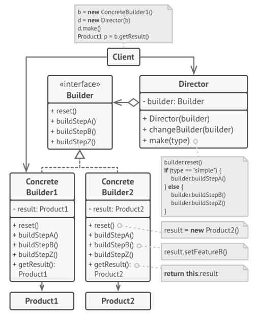

# Title

## Prerequisite

This documents assume that
 - You have basic knowledge of c#
 - You know how to read class diagram

&nbsp;
## 1. Intent

Separate the construction of a complex object from its representation so that the same construction process can create diffent representations.<sup>a)</sup>

&nbsp;
## 2. Structure
#### Class diagram
\
_BCIT COMP3522_<sup>b)</sup>


&nbsp;
## 3. Participants
There are many participants as you can see above class diagram.
- `Builder`
    - The Builder specifies an abstract interface for creating parts of a Product.
- `ConcreteBuilder`
    - The ConcreteBuilder constructs and assembles parts of the product by implementing the Builder interface. It must also define and track the representation it creates.
- `Product`
    - The Product represents the object being constructed. It includes classes for defining the parts of the object, including any interfaces for assembling the parts into the final result.
- `Director`
    - The Director constructs an object using the Builder interface.

https://exceptionnotfound.net/builder-pattern-in-csharp/<sup>c)</sup>


&nbsp;
## 4. Sample Code 
`IBuilder`
```c#
    public interface IBuilder
    {
        void BuildPartA();
        void BuildPartB();
        void BuildPartC();
    }
```

`ConcreteBuilder`
```c#
    public class ConcreteBuilder : IBuilder
    {
        private Product _product = new();
        public ConcreteBuilder()
        {
            Reset();
        }

        private void Reset()
        {
            _product = new Product();
        }
        public void BuildPartA()
        {
            _product.Add("PartA");
        }
        public void BuildPartB()
        {
            _product.Add("PartB");
        }
        public void BuildPartC()
        {
            _product.Add("PartC");
        }
        public Product GetProduct()
        {
            var result = _product;
            Reset();
            return result;
        }
    }
```

`Product`
```c#
    public class Product
    {
        private readonly List<object> _parts = new();
        public void Add(string part)
        {
            _parts.Add(part);
        }
        public string ListParts()
        {
            var str = string.Empty;
            for (var i = 0; i < _parts.Count; i++)
            {
                str += _parts[i] + ", ";
            }
            str = str.Remove(str.Length - 2);
            return "Product parts: " + str + "\n";
        }
    }
```

`Director` <sub>(Optional)</sub>
```c#
    public class Director
    {
        private IBuilder _builder;

        public IBuilder Builder
        {
            set => _builder = value;
        }

        public void BuildMinimalViableProduct()
        {
            _builder.BuildPartA();
        }

        public void BuildFullFeaturedProduct()
        {
            _builder.BuildPartA();
            _builder.BuildPartB();
            _builder.BuildPartC();
        }
    }
```

`Program` <sub>(Client)</sub>
```c#
    class Program
    {
        static void Main(string[] args)
        {
            var director = new Director();
            var builder = new ConcreteBuilder();
            director.Builder = builder;
            
            Console.WriteLine("Standard basic product:");
            director.BuildMinimalViableProduct();
            Console.WriteLine(builder.GetProduct().ListParts());

            Console.WriteLine("Standard full featured product:");
            director.BuildFullFeaturedProduct();
            Console.WriteLine(builder.GetProduct().ListParts());

            // Without director (director is OPTIONAL)
            Console.WriteLine("Custom product:");
            builder.BuildPartA();
            builder.BuildPartC();
            Console.Write(builder.GetProduct().ListParts());
        }
    }
```

Output
```
Standard basic product:
Product parts: PartA

Standard full featured product:
Product parts: PartA, PartB, PartC

Custom product:
Product parts: PartA, PartC
```
https://refactoring.guru/design-patterns/builder/csharp/example<sup>d)</sup>

&nbsp;
## 5. Pros and Cons
### Pros 👍
- This pattern is very useful when there are many properties in a product(item) class and each of them needs to be customized often.
- Constructor is simplified. Good to apply it when there are many parameters, most of which may not even be used often.

### Cons 👎
- It doesn't work very well with products that is dependent between properties.
- Code complexity may increase.
- It's hard to make a product if the builder needs to call many methods to build the product.

&nbsp;
## 6. References
#### a) Erich Gamma, Richard Helm, Ralph Johnson, John Vlissides, _Design Patterns - Elements of Reusable Object-Oriented Software_ (Addison-Wesley, 1994), 97
#### b) British Columbia Institute of Technology COMP3522 Week12, DesignPatternsTable
#### c) https://exceptionnotfound.net/builder-pattern-in-csharp/
#### d) https://refactoring.guru/design-patterns/builder/csharp/example

