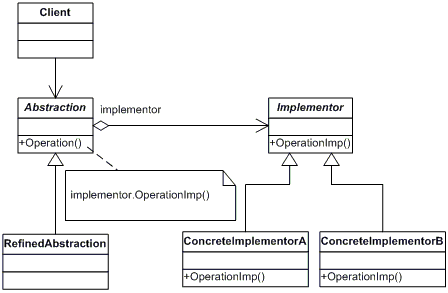

# Bridge

## Prerequisite

This documents assume that
 - You have basic knowledge of c#
 - You know how to read class diagram

&nbsp;
## 1. Intent

Decouple an abstraction from its implementation so that the two can vary independently.<sup>a)</sup>

&nbsp;
## 2. Structure
#### Class diagram
\
https://www.dofactory.com/net/bridge-design-pattern#uml<sup>b)</sup>


&nbsp;
## 3. Participants
- `Abstraction`
    - defines the abstraction's interface.
    - maintains a reference to an object of type Implementor.
- `RefinedAbstraction`
    - extends the interface defined by Abstraction.
- `Implementor`
    - defines the interface for implementation classes. This interface doesn't have to correspond exactly to Abstraction's interface; in fact the two interfaces can be quite different. Typically the Implementation interface provides only primitive operations, and Abstraction defines higher-level operations based on these primitives.
- `ConcreteImplementor`
    - implements the Implementor interface and defines its concrete implementation.

https://www.dofactory.com/net/bridge-design-pattern#participants<sup>c)</sup>


&nbsp;
## 4. Sample Code 
`Bridge`
```c#
using System;

namespace Bridge.Structural
{
    /// <summary>
    /// Bridge Design Pattern
    /// </summary>

    public class Program
    {
        public static void Main(string[] args)
        {
            Abstraction ab = new RefinedAbstraction();

            // Set implementation and call

            ab.Implementor = new ConcreteImplementorA();
            ab.Operation();

            // Change implemention and call

            ab.Implementor = new ConcreteImplementorB();
            ab.Operation();

            // Wait for user

            Console.ReadKey();
        }
    }

    /// <summary>
    /// The 'Abstraction' class
    /// </summary>

    public class Abstraction
    {
        protected Implementor implementor;

        public Implementor Implementor
        {
            set { implementor = value; }
        }

        public virtual void Operation()
        {
            implementor.Operation();
        }
    }

    /// <summary>
    /// The 'Implementor' abstract class
    /// </summary>

    public abstract class Implementor
    {
        public abstract void Operation();
    }

    /// <summary>
    /// The 'RefinedAbstraction' class
    /// </summary>

    public class RefinedAbstraction : Abstraction
    {
        public override void Operation()
        {
            implementor.Operation();
        }
    }

    /// <summary>
    /// The 'ConcreteImplementorA' class
    /// </summary>

    public class ConcreteImplementorA : Implementor
    {
        public override void Operation()
        {
            Console.WriteLine("ConcreteImplementorA Operation");
        }
    }

    /// <summary>
    /// The 'ConcreteImplementorB' class
    /// </summary>

    public class ConcreteImplementorB : Implementor
    {
        public override void Operation()
        {
            Console.WriteLine("ConcreteImplementorB Operation");
        }
    }
}
```
Output
```
ConcreteImplementorA Operation
ConcreteImplementorB Operation
```
https://www.dofactory.com/net/bridge-design-pattern#structural<sup>d)</sup>


`Realworld Example`
```c#
using System;
using System.Collections.Generic;

namespace Bridge.RealWorld
{
    /// <summary>
    /// Bridge Design Pattern
    /// </summary>

    public class Program
    {
        public static void Main(string[] args)
        {
            // Create RefinedAbstraction

            var customers = new Customers();

            // Set ConcreteImplementor

            customers.Data = new CustomersData("Chicago");

            // Exercise the bridge

            customers.Show();
            customers.Next();
            customers.Show();
            customers.Next();
            customers.Show();
            customers.Add("Henry Velasquez");

            customers.ShowAll();

            // Wait for user

            Console.ReadKey();
        }
    }
    /// <summary>
    /// The 'Abstraction' class
    /// </summary>

    public class CustomersBase
    {
        private DataObject dataObject;

        public DataObject Data
        {
            set { dataObject = value; }
            get { return dataObject; }
        }

        public virtual void Next()
        {
            dataObject.NextRecord();
        }

        public virtual void Prior()
        {
            dataObject.PriorRecord();
        }

        public virtual void Add(string customer)
        {
            dataObject.AddRecord(customer);
        }

        public virtual void Delete(string customer)
        {
            dataObject.DeleteRecord(customer);
        }

        public virtual void Show()
        {
            dataObject.ShowRecord();
        }

        public virtual void ShowAll()
        {
            dataObject.ShowAllRecords();
        }
    }

    /// <summary>
    /// The 'RefinedAbstraction' class
    /// </summary>

    public class Customers : CustomersBase
    {
        public override void ShowAll()
        {
            // Add separator lines

            Console.WriteLine();
            Console.WriteLine("------------------------");
            base.ShowAll();
            Console.WriteLine("------------------------");
        }
    }

    /// <summary>
    /// The 'Implementor' abstract class
    /// </summary>

    public abstract class DataObject
    {
        public abstract void NextRecord();
        public abstract void PriorRecord();
        public abstract void AddRecord(string name);
        public abstract void DeleteRecord(string name);
        public abstract string GetCurrentRecord();
        public abstract void ShowRecord();
        public abstract void ShowAllRecords();
    }

    /// <summary>
    /// The 'ConcreteImplementor' class
    /// </summary>

    public class CustomersData : DataObject
    {
        private readonly List<string> customers = new List<string>();
        private int current = 0;
        private string city;

        public CustomersData(string city)
        {
            this.city = city;

            // Loaded from a database 

            customers.Add("Jim Jones");
            customers.Add("Samual Jackson");
            customers.Add("Allen Good");
            customers.Add("Ann Stills");
            customers.Add("Lisa Giolani");
        }

        public override void NextRecord()
        {
            if (current <= customers.Count - 1)
            {
                current++;
            }
        }

        public override void PriorRecord()
        {
            if (current > 0)
            {
                current--;
            }
        }

        public override void AddRecord(string customer)
        {
            customers.Add(customer);
        }

        public override void DeleteRecord(string customer)
        {
            customers.Remove(customer);
        }

        public override string GetCurrentRecord()
        {
            return customers[current];
        }

        public override void ShowRecord()
        {
            Console.WriteLine(customers[current]);
        }

        public override void ShowAllRecords()
        {
            Console.WriteLine("Customer City: " + city);

            foreach (string customer in customers)
            {
                Console.WriteLine(" " + customer);
            }
        }
    }
}
```
Output
```
Jim Jones
Samual Jackson
Allen Good

------------------------
Customer Group: Chicago
Jim Jones
Samual Jackson
Allen Good
Ann Stills
Lisa Giolani
Henry Velasquez
------------------------
```
https://www.dofactory.com/net/bridge-design-pattern#realworld<sup>e)</sup>

&nbsp;
## 5. Pros and Cons
### Pros 👍
- Less refactoring is needed because of decoupling abstraction from implementation.
- inherited classes from abstract and interface works independently.

### Cons 👎
- Not a good idea if no additional classes will be added in the future.
- Possibly have a negative impact for performance because of the indirection of the request from the abstraction to the implementor.

&nbsp;
## 6. References
#### a) Erich Gamma, Richard Helm, Ralph Johnson, John Vlissides, _Design Patterns - Elements of Reusable Object-Oriented Software_ (Addison-Wesley, 1994), 151
#### b) https://www.dofactory.com/net/bridge-design-pattern#uml
#### c) https://www.dofactory.com/net/bridge-design-pattern#participants
#### d) https://www.dofactory.com/net/bridge-design-pattern#structural
#### e) https://www.dofactory.com/net/bridge-design-pattern#realworld

