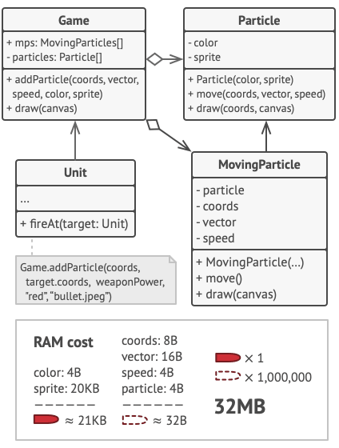

# Flyweight (cached object)

m. a weight in boxing and other sports intermediate between light flyweight and bantamweight. In boxing it ranges from 48 to 51 kg.

### In One Liner

Share several immutable cache instances among general components to support commonly shared attributes which are heavy or memory expensive.


[Reference](https://refactoring.guru/design-patterns/flyweight)

### Pros 

- Save lots of memory by sharing same objects among other components.

### Cons

- Trades off code complexity and CPU cycle (CPU commands & extra logics) with memory.

### Discussion Point

Flyweight pattern mainly focuses on memory perspective when it comes to dealing with lots of components. Since the pattern structure gets complicated very fast as well, it could be overkill if the memory is not a huge concern. 

### Example

**Original Particle class**
```c++
class Particle
{
public:
    bool draw();
    bool move();
private:
    Eigen::Vector2d mCoord;
    Eigen::Vector3d mDirection;
    float mSpeed;
    int mColor;
    std::string mSprite;
}
```

**Flyweight Particle class**
```c++
class RenderedParticle
{
public:
    bool draw()
    {
        // Use Color
        // Apply sprite        
    }
    bool move();
private:
    int mColor;
    std::string mSprite;
}

class ShootingParticle
{
public:
    bool draw()
    {
        // 1. Move to mCoord
        // 2. Look at mDirection
        // 3. Multiply mSpeed to directional vector

        // 4. Draw color and sprite of the particle
        mpRefParticle->draw();
    }
    bool move();
private:
    Eigen::Vector2d mCoord;
    Eigen::Vector3d mDirection;
    float mSpeed;
    RenderedParticle* mpRefParticle;
}
```
