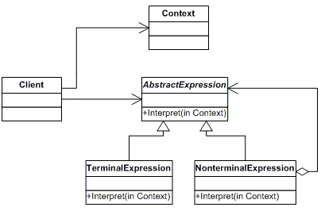

# Interpreter

## Prerequisite

This documents assume that
 - You have basic knowledge of c#
 - You know how to read class diagram

&nbsp;
## 1. Intent

Given a language, define a representation for its grammar along with an interpreter that uses the representation to interpret sentences in the language.<sup>a)</sup>

&nbsp;
## 2. Structure
#### Class diagram
\
https://www.dofactory.com/net/interpreter-design-pattern<sup>b)</sup>


&nbsp;
## 3. Participants
- `AbstractExpression`
    - Declares an interface for executing an operation
- `TerminalExpression`
    - Implements an Interpret operation associated with terminal symbols in the grammar.
    - An instance is required for every terminal symbol in the sentence.
- `NonterminalExpression`
    - One such class is required for every rule R ::= R1R2...Rn in the grammar
    - Maintains instance variables of type AbstractExpression for each of the symbols R1 through Rn.
    - Implements an Interpret operation for nonterminal symbols in the grammar. Interpret typically calls itself recursively on the variables representing R1 through Rn.
- `Context`
    - Contains information that is global to the interpreter
- `Client`
    - Builds (or is given) an abstract syntax tree representing a particular sentence in the language that the grammar defines. The abstract syntax tree is assembled from instances of the NonterminalExpression and TerminalExpression classes
    - Invokes the Interpret operation

https://www.dofactory.com/net/interpreter-design-pattern<sup>c)</sup>


&nbsp;
## 4. Sample Code 
`Interpreter`
```c#
using System;
using System.Collections.Generic;

namespace Interpreter.Structural
{
    public class Program
    {
        public static void Main(string[] args)
        {
            Context context = new Context();
            List<AbstractExpression> list = new List<AbstractExpression>();
            list.Add(new TerminalExpression());
            list.Add(new NonterminalExpression());
            list.Add(new TerminalExpression());
            list.Add(new TerminalExpression());
            foreach (AbstractExpression exp in list)
            {
                exp.Interpret(context);
            }
            Console.ReadKey();
        }
    }

    public class Context
    {
    }
    public abstract class AbstractExpression
    {
        public abstract void Interpret(Context context);
    }
    public class TerminalExpression : AbstractExpression
    {
        public override void Interpret(Context context)
        {
            Console.WriteLine("Called Terminal.Interpret()");
        }
    }
    public class NonterminalExpression : AbstractExpression
    {
        public override void Interpret(Context context)
        {
            Console.WriteLine("Called Nonterminal.Interpret()");
        }
    }
}

```
Output
```
Called Terminal.Interpret()
Called Nonterminal.Interpret()
Called Terminal.Interpret()
Called Terminal.Interpret()
```

&nbsp;
## 5. Pros and Cons
### Pros 👍
- Easy to implement
- Easy to modify

### Cons 👎
- Complex code are hard to maintain

&nbsp;
## 6. References
#### a) Erich Gamma, Richard Helm, Ralph Johnson, John Vlissides, _Design Patterns - Elements of Reusable Object-Oriented Software_ (Addison-Wesley, 1994), 243
#### b), c) https://www.dofactory.com/net/interpreter-design-pattern
