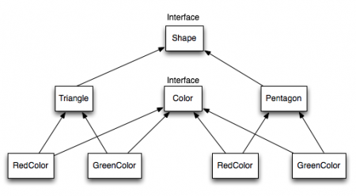

# [Subin] Bridge

> 기능 클래스 계층 ------- 구현 클래스 계층 을 이어주는 '다리' 역할을 하는 Bridge 패턴

[Source](https://refactoring.guru/design-patterns/bridge)

> 문제 제기

`Shape` 클래스에 `Circle`과 `Square`라는 두 개의 하위 클래스가 있다고 생각해보자. 

색을 칠하는 기능을 추가하고 싶다면? 

[Source](https://refactoring.guru/design-patterns/bridge)

> 해결책

`Shape` 클래스에 '모양'이라는 구현 클래스와 '색칠' 이라는 기능 클래스를 한꺼번에 상속하려고 하다 보니, 전체적인 클래스 계층이 거대해지고 있다. 

이때 우리는 기능 클래스와 구현 클래스를 분리하고, Bridge 패턴을 사용해 그 두 클래스를 연결해 위와 같은 문제를 해결할 수 있다. 

[Source](https://refactoring.guru/design-patterns/bridge)

이때 우리는 색칠과 관련된 모든 코드는 `Red`와 `Blue` 클래스로 옮겨, 그 기능 클래스를 분리할 수 있다. 
그리고 `Shape` 안에서 color object를 가리키는 reference field를 하나 만들어 색칠과 관련된 모든 기능을 위임할 수 있다. 이때 바로 이 reference object가 `Shape`와 `Color` 클래스 간에 '다리' 역할을 하는 것이다. 

## What is Bridge?

- implementation으로부터 abstraction 레이어를 분리하여 이 둘이 서로 독립적으로 변화할 수 있도록 해주는 패턴

- 구현부에서 추상층을 분리, 각자 독립적으로 변형이 가능하고 확장이 가능하도록 해주는 디자인 패턴. 기능과 구현에 대해 별도의 클래스로 구현한다

- 두 개의 다른 계층(추상, 구현) 사이의 coupling을 약화시키면서 협력은 가능하도록 하는 패턴

### Bridge 패턴의 구조

[Source](https://refactoring.guru/design-patterns/bridge)

- Abstraction
  - 기능 계층의 최상위 클래스. 구현 부분에 해당하는 클래스의 인스턴스를 가지고 해당 인스턴스를 통해 구현 부분의 메소드를 호출.

- Implementation
  - Abstraction의 기능을 구현하기 위한 인터페이스를 정의. Abstraction은 implementation object들과 여기에서 선언된 메소드들을 통해서만 소통할 수 있음

- Concrete Implementation
  - 실제 기능 구현

- Refined Abstractions
  - optional; 기능 계층에서 새로운 부분을 확장한 클래스

- Client
  - 클라이언트는 오직 Abstraction 층에서만 작업. 클라이언트는 Abstraction 층에서 만든 abstraction object와 implementation object를 연결하는 작업을 할 수 있음

## How to implement it?

[Source](https://readystory.tistory.com/194)

**Color.java**
~~~
public interface Color {
 
	public void applyColor();
}
~~~

**Shape.java**
~~~
public abstract class Shape {
	//Composition
	protected Color color;
	
	//constructor with implementor as input argument
	public Shape(Color c){
		this.color=c;
	}
	
	abstract public void applyColor();
}
~~~
-> Shape 클래스가 Color 인터페이스를 가지고 있고, applyColor() 메소드는 abstract로 선언해 하위 클래스들이 구현할 수 있도록 위임하고 있다. 

**Triangle.java**
~~~
public class Triangle extends Shape {
 
	public Triangle(Color c) {
		super(c);
	}
 
	@Override
	public void applyColor() {
		System.out.print("Triangle filled with color ");
		color.applyColor();
	} 
 
}
~~~
-> Shape 추상 클래스를 상속해 구체화 하는 Triangle 클래스

**Pentagon.java**
~~~
public class Pentagon extends Shape {
 
	public Pentagon(Color c) {
		super(c);
	}
 
	@Override
	public void applyColor() {
		System.out.print("Pentagon filled with color ");
		color.applyColor();
	} 
 
}
~~~

**RedColor.java**
~~~
public class RedColor implements Color{
 
	public void applyColor(){
		System.out.println("red.");
	}
}
~~~
-> 각 Shape 클래스가 소유하는 Color interface의 구현 객체를 정의

**GreenColor.java**
~~~
public class GreenColor implements Color{
 
	public void applyColor(){
		System.out.println("green.");
	}
}
~~~

**Client.java**
~~~
public class Client {
    public static void main(String[] args) {
        Shape tri = new Triangle(new RedColor());
		tri.applyColor();
		
		Shape pent = new Pentagon(new GreenColor());
		pent.applyColor();
    }
}
~~~

**Output**
~~~
Triangle filled with color red.
Pentagon filled with color green.
~~~

## Advantage
- 추상화된 부분과 실제 구현 부분을 독립적으로 확장할 수 있다
- 추상화된 부분을 구현한 구상 클래스를 수정해도 클라이언트에게는 영향을 미치지 않을 수 있다

## Disadvantage
- 디자인이 비교적 복잡해진다