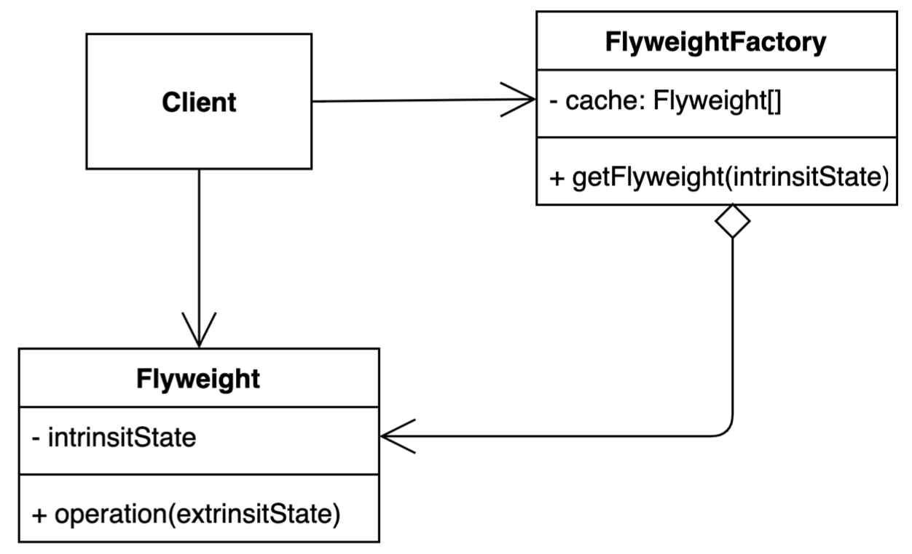
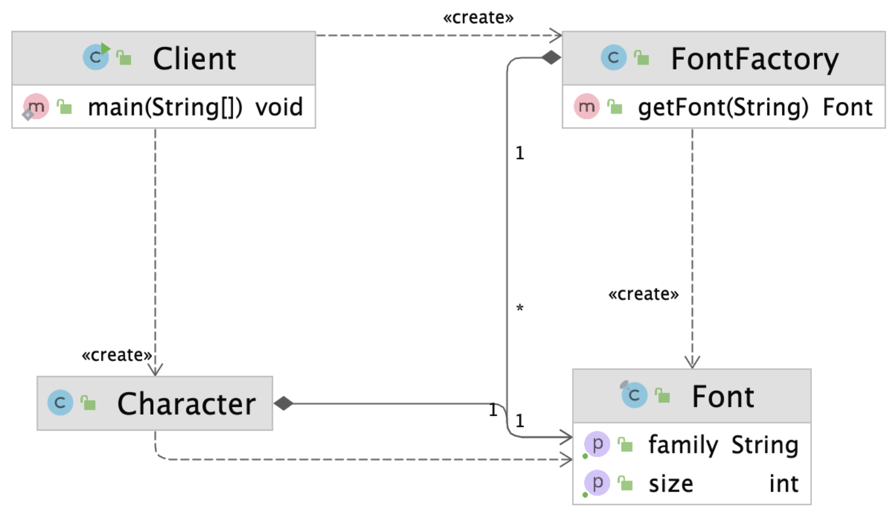

# Flyweight Pattern

### 📝 Caching 으로 메모리 사용을 줄여보자!

* 자주 변하는 속성과 변하지 않는 속성을 분리하고 재사용하여 메모리 사용을 줄일 수 있다.


## 1. Implementation
* 변하지 않는 동일한 정보를 여러 곳에서 사용는 경우


## 2. Pros and cons
* 장점:
    * 애플리케이션에서 사용하는 메모리를 줄일 수 있다.
* 단점
    * 코드의 복잡도가 증가한다.

## 3. Example
* Java
    * Integer.valueOf(int)
    * 캐시를 제공한다.
  > valueOf method in Integer class ([Java Doc](https://docs.oracle.com/javase/8/docs/api/java/lang/Integer.html#valueOf-int-))
    ```
     /**
     * Returns an {@code Integer} instance representing the specified
     * {@code int} value.  If a new {@code Integer} instance is not
     * required, this method should generally be used in preference to
     * the constructor {@link #Integer(int)}, as this method is likely
     * to yield significantly better space and time performance by
     * caching frequently requested values.
     *
     * This method will always cache values in the range -128 to 127,
     * inclusive, and may cache other values outside of this range.
     *
     * @param  i an {@code int} value.
     * @return an {@code Integer} instance representing {@code i}.
     * @since  1.5
     */
    
    static final Integer[] cache;
    
    @IntrinsicCandidate
    public static Integer valueOf(int i) {
        if (i >= IntegerCache.low && i <= IntegerCache.high)
            return IntegerCache.cache[i + (-IntegerCache.low)];
        return new Integer(i);
    }
  ```